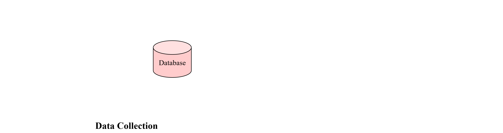

# <h1 align="center">C<sup>2</sup>LEVA: Toward Comprehensive and Contamination-Free Language Model Evaluation</h1>
<div align="center">

[](https://github.com/Lavi-Lab/C2LEVA/stargazers)
[](https://creativecommons.org/licenses/by-nc-nd/4.0/)
[](https://github.com/LaVi-Lab/C2LEVA/issues/new)

[🌐Website](http://www.lavicleva.com/c2leva/)
•[📜Paper \[ACL 2025 Findings\]](https://arxiv.org/abs/2412.04947)
•✉️<a href="mailto:clevaplat@gmail.com">Email</a>

</div>

## 🎯 Introduction

> **TL;DR:** We release C<sup>2</sup>LEVA, a comprehensive bilingual benchmark with systematic contamination prevention. Large-scale evaluation on 15 large language models demonstrates the effectiveness of C<sup>2</sup>LEVA.

Recent advances in large language models (LLMs) have shown significant promise, yet their evaluation raises concerns, particularly regarding data contamination due to the lack of access to proprietary training data.

To address this issue, we present <b><a href="https://arxiv.org/abs/2412.04947">C<sup>2</sup>LEVA</a></b>, which offers **(1)** a holistic bilingual (Chinese and English) benchmark encompassing 22 tasks, each targeting a specific application or ability of LLMs; **(2)** A trustworthy assessment due to our contamination-free tasks, ensured by a systematic contamination prevention strategy that fully automates test data renewal and enforces data protection during benchmark data release.

Our large-scale evaluation of 15 open-source and proprietary models shows that C<sup>2</sup>LEVA achieves a 94.8% correlation with [Chatbot Arena](https://lmarena.ai/?leaderboard)'s overall rankings, while being fully transparent and reproducible.



## 🔥 News

- **\[2025.05.16\]** <a href="https://arxiv.org/abs/2412.04947">C<sup>2</sup>LEVA</a> has been accepted to [Findings of ACL 2025](https://2025.aclweb.org/). 🔥🔥🔥
- **\[2024.12.06\]** We are thrilled to announce <a href="https://arxiv.org/abs/2412.04947">C<sup>2</sup>LEVA</a>, an effort toward building a comprehensive bilingual benchmark with systematic contamination prevention.

## ⏬ Download Data

Below are the links to request the past versions of C<sup>2</sup>LEVA test sets.

- [2024-07-04](https://forms.gle/1Y7pP1SsmSoyhpfC6)

## 🛂 License

C<sup>2</sup>LEVA is licensed under a Creative Commons Attribution-NonCommercial-NoDerivatives 4.0 International License.

You should have received a copy of the license along with this work. If not, see <https://creativecommons.org/licenses/by-nc-nd/4.0/>.

## 🖊️ Citation

Please cite our paper if you use C<sup>2</sup>LEVA in your work:
```bib
@misc{li2024c2leva,
      title={C$^2$LEVA: Toward Comprehensive and Contamination-Free Language Model Evaluation}, 
      author={Yanyang Li and Tin Long Wong and Cheung To Hung and Jianqiao Zhao and Duo Zheng and Ka Wai Liu and Michael R. Lyu and Liwei Wang},
      year={2024},
      eprint={2412.04947},
      archivePrefix={arXiv},
      primaryClass={cs.CL},
      url={https://arxiv.org/abs/2412.04947}, 
}
```

You are also welcome to cite the early CLEVA:
```bib
@misc{li2023cleva,
      title={CLEVA: Chinese Language Models EVAluation Platform}, 
      author={Yanyang Li and Jianqiao Zhao and Duo Zheng and Zi-Yuan Hu and Zhi Chen and Xiaohui Su and Yongfeng Huang and Shijia Huang and Dahua Lin and Michael R. Lyu and Liwei Wang},
      year={2023},
      eprint={2308.04813},
      archivePrefix={arXiv},
      primaryClass={cs.CL}
}
```
